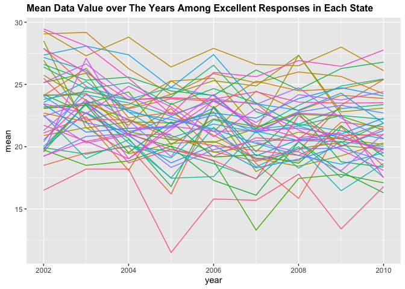
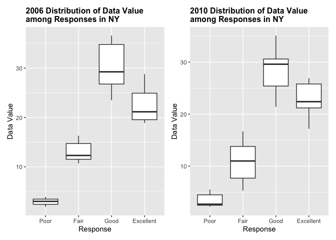
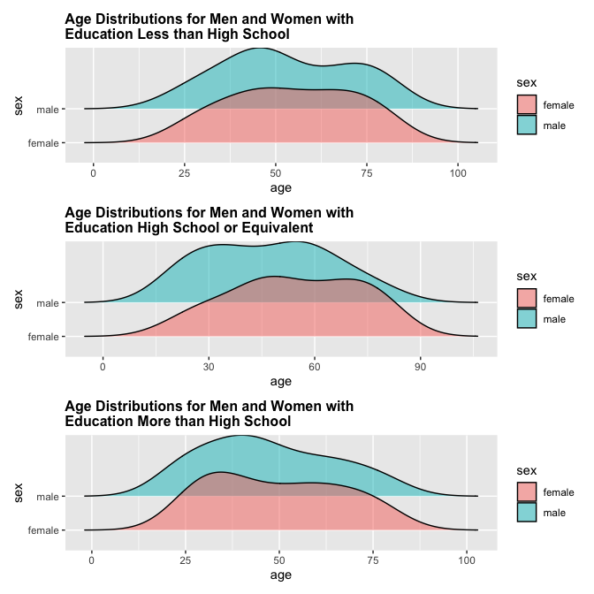
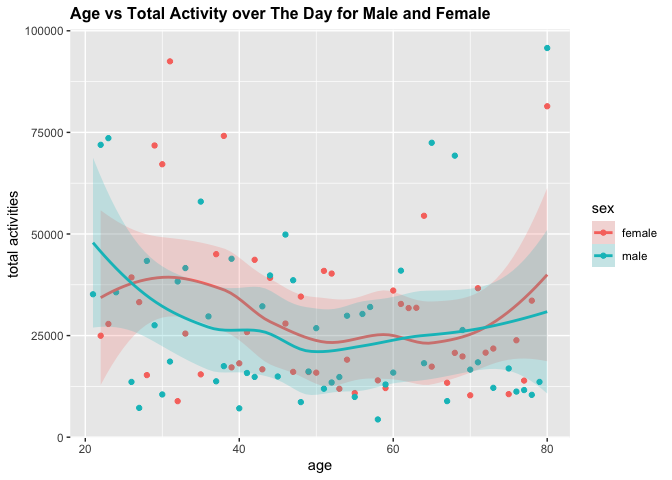
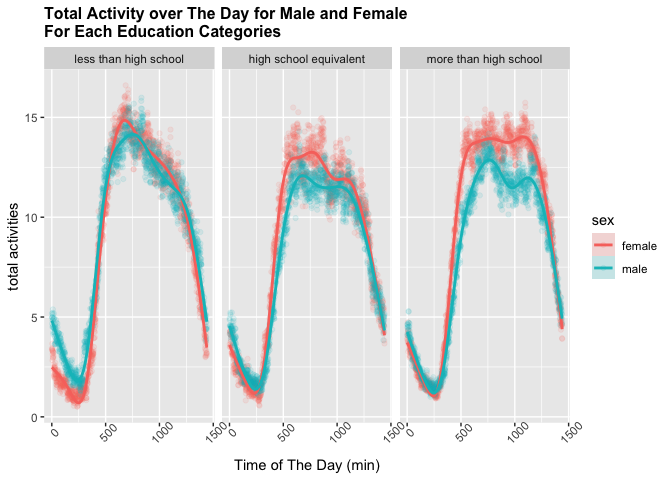

p8105_hw3_jkl2195
================
Jessie Li
2023-10-08

    ## ── Attaching core tidyverse packages ──────────────────────── tidyverse 2.0.0 ──
    ## ✔ dplyr     1.1.3     ✔ readr     2.1.4
    ## ✔ forcats   1.0.0     ✔ stringr   1.5.0
    ## ✔ ggplot2   3.4.3     ✔ tibble    3.2.1
    ## ✔ lubridate 1.9.2     ✔ tidyr     1.3.0
    ## ✔ purrr     1.0.2     
    ## ── Conflicts ────────────────────────────────────────── tidyverse_conflicts() ──
    ## ✖ dplyr::filter() masks stats::filter()
    ## ✖ dplyr::lag()    masks stats::lag()
    ## ℹ Use the conflicted package (<http://conflicted.r-lib.org/>) to force all conflicts to become errors

Loads the data

``` r
data("instacart")
instacart = 
  instacart |> 
  as_tibble()

data("brfss_smart2010")
brfss_smart2010 =
  brfss_smart2010 |>
  as_tibble()
```

# Problem 1

There are a total of 1384617 rows and 15 cols in this dataset. This
dataset contains characterization of Instacart orders. Some
characterization includes product name, aisles (ex: fresh vegetables,  
lunch meat), department(ex: produce, deli), if the product has been
ordered by the same customer before, the order which customer selects
each product, the days since last order, and its product and order id.
The data contains 39123 products, 131209, orders from 131209 distinct
users.

There are in total of 134 aisles with the top three ordered fresh
vegetables, fresh fruits, packaged vegetables fruits, 150609, 150473,
78493.

This is a plot that shows the number of items ordered in each aisle,
limiting this to aisles with more than 10000 items ordered.

``` r
instacart |>
  count(aisle) |>
  filter(n > 10000) |>
  mutate(aisle = fct_reorder(aisle, n)) |>
  ggplot(aes(x = aisle, y = n)) +
  geom_point() + 
  labs(title = "Number of items ordered in each aisle") +
  theme(axis.text.x = element_text(angle = 60, hjust = 1))
```

<!-- -->

This is a table showing the three most popular items in each of the
aisles “baking ingredients”, “dog food care”, and “packaged vegetables
fruits” with the number of times each item is ordered

``` r
instacart |>
  filter(aisle %in% c("baking ingredients", "dog food care", "packaged vegetables fruits")) |>
  group_by(aisle) |>
  count(product_name) |>
  mutate(
    rank = min_rank(desc(n))
  ) |>
  filter(rank < 4) |>
  arrange(desc(n))
```

    ## # A tibble: 9 × 4
    ## # Groups:   aisle [3]
    ##   aisle                      product_name                                n  rank
    ##   <chr>                      <chr>                                   <int> <int>
    ## 1 packaged vegetables fruits Organic Baby Spinach                     9784     1
    ## 2 packaged vegetables fruits Organic Raspberries                      5546     2
    ## 3 packaged vegetables fruits Organic Blueberries                      4966     3
    ## 4 baking ingredients         Light Brown Sugar                         499     1
    ## 5 baking ingredients         Pure Baking Soda                          387     2
    ## 6 baking ingredients         Cane Sugar                                336     3
    ## 7 dog food care              Snack Sticks Chicken & Rice Recipe Dog…    30     1
    ## 8 dog food care              Organix Chicken & Brown Rice Recipe        28     2
    ## 9 dog food care              Small Dog Biscuits                         26     3

This is a table showing the mean hour of the day at which Pink Lady
Apples and Coffee Ice Cream are ordered on each day of the week

``` r
instacart |>
  filter(product_name %in% c("Pink Lady Apples", "Coffee Ice Cream"))|>
  group_by(product_name, order_dow) |>
  count(order_hour_of_day) |>
  summarize(
    mean = round(mean(n),2)
  ) |>
  pivot_wider(
    names_from = order_dow,
    values_from = mean
  )
```

    ## `summarise()` has grouped output by 'product_name'. You can override using the
    ## `.groups` argument.

    ## # A tibble: 2 × 8
    ## # Groups:   product_name [2]
    ##   product_name       `0`   `1`   `2`   `3`   `4`   `5`   `6`
    ##   <chr>            <dbl> <dbl> <dbl> <dbl> <dbl> <dbl> <dbl>
    ## 1 Coffee Ice Cream  2.82  1.73  1.75  1.83  2.09  1.36  2.4 
    ## 2 Pink Lady Apples  2.27  3.57  2.76  2.46  2.07  3     1.45

# Problem 2

Clean up data by clean up variable names, focus on the “Overall Health”
topic, removing data entries with reponses as “Very good”, and convert
responses as a factor taking levels ordered from “Poor” to “Excellent”.

``` r
brfss_smart2010 = brfss_smart2010 |>
  janitor::clean_names("snake") |>
  filter(topic %in% c("Overall Health")) |>
  rename(
    state = locationabbr,
    location = locationdesc
  ) |>
  filter(!response %in% c("Very good")) |>
  mutate(
    response = factor(response, levels = c("Poor", "Fair", "Good", "Excellent"))
  )
```

**Q: In 2002, which states were observed at 7 or more locations? What
about in 2010?**

``` r
brfss_2002_multiloc_state = brfss_smart2010 |>
  filter(year == 2002) |>
  group_by(state) |>
  distinct(geo_location) |>
  summarize(num_of_locations = n()) |>
  filter(num_of_locations >= 7) |>
  mutate(
    location_full = state.name[match(state, state.abb)]
  )|>
  pull(location_full)

brfss_2010_multiloc_state = brfss_smart2010 |>
  filter(year == 2010) |>
  group_by(state) |>
  distinct(geo_location) |>
  summarize(num_of_locations = n()) |>
  filter(num_of_locations >= 7) |>
  mutate(
    location_full = state.name[match(state, state.abb)]
  )|>
  pull(location_full)
```

In 2002, Connecticut, Florida, Massachusetts, North Carolina, New
Jersey, Pennsylvania (6 total) were observed at 7 or more locations. And
in 2010, California, Colorado, Florida, Massachusetts, Maryland, North
Carolina, Nebraska, New Jersey, New York, Ohio, Pennsylvania, South
Carolina, Texas, Washington (14 total) were observed at 7 or more
locations

This is a “spaghetti” plot limited of the Excellent responses of each
states that maps averages the data_value across locations within a state
over the years.

``` r
brfss_smart2010_excellent = brfss_smart2010 |>
  filter(response == "Excellent") |>
  group_by(state, year) |>
  mutate(mean = mean(data_value)) |>
  select(year, state, mean)
brfss_smart2010_excellent |>
  ggplot(aes(x = year, y = mean, group = state, color = state)) +
  geom_line() +
  ggtitle("Mean Data Value over The Years Among Excellent Responses in Each State") + 
  theme(
    legend.position = "none",
    plot.title = element_text(size = 12, face = "bold")
  ) 
```

    ## Warning: Removed 65 rows containing missing values (`geom_line()`).

<!-- -->

Make a two-panel plot showing, for the years 2006, and 2010,
distribution of data_value for responses (“Poor” to “Excellent”) among
locations in NY State.

``` r
brfss_2006_data_value = brfss_smart2010 |>
  filter(year == 2006, state == "NY") |>
  select(response, data_value) |>
  ggplot(aes(x = response, y = data_value)) +
  geom_boxplot() +
  labs(
    title = "2006 Distribution of Data Value \namong Responses in NY",
    x = "Response",
    y = "Data Value"
  ) + 
  theme(
    plot.title = element_text(size = 12, face = "bold")
  )

brfss_2010_data_value = brfss_smart2010 |>
  filter(year == 2010, state == "NY") |>
  select(response, data_value) |>
  ggplot(aes(x = response, y = data_value)) +
  geom_boxplot() +
  labs(
    title = "2010 Distribution of Data Value \namong Responses in NY",
    x = "Response",
    y = "Data Value"
  ) + 
  theme(
    plot.title = element_text(size = 12, face = "bold")
  )

brfss_2006_data_value + brfss_2010_data_value
```

<!-- -->

# Problem 3

**Background:** Accelerometers have become an appealing alternative to
self-report techniques for studying physical activity in observational
studies and clinical trials, largely because of their relative
objectivity. During observation periods, the devices can measure MIMS in
a short period; one-minute intervals are common. Because accelerometers
can be worn comfortably and unobtrusively, they produce around-the-clock
observations.

``` r
substr("Hello",4,7)
```

    ## [1] "lo"

Reads data

``` r
nhanes_accel = read_csv("data/nhanes_accel.csv") |>
  janitor::clean_names() 
```

    ## Rows: 250 Columns: 1441
    ## ── Column specification ────────────────────────────────────────────────────────
    ## Delimiter: ","
    ## dbl (1441): SEQN, min1, min2, min3, min4, min5, min6, min7, min8, min9, min1...
    ## 
    ## ℹ Use `spec()` to retrieve the full column specification for this data.
    ## ℹ Specify the column types or set `show_col_types = FALSE` to quiet this message.

``` r
nhanes_covar = read_csv("data/nhanes_covar.csv", skip = 4) |>
  janitor::clean_names() |>
  filter(
    age >= 21,
    !is.na(sex),
    !is.na(education),
    !is.na(age)
  ) |>
  mutate(
    sex = case_match(
      sex,
      1 ~ "male",
      2 ~ "female"
    ),
    education = case_match(
      education,
      1 ~ "less than high school",
      2 ~ "high school equivalent",
      3 ~ "more than high school"
    ), 
    education = factor(education,
      levels = c("less than high school", "high school equivalent", "more than high school")
    )
  )
```

    ## Rows: 250 Columns: 5
    ## ── Column specification ────────────────────────────────────────────────────────
    ## Delimiter: ","
    ## dbl (5): SEQN, sex, age, BMI, education
    ## 
    ## ℹ Use `spec()` to retrieve the full column specification for this data.
    ## ℹ Specify the column types or set `show_col_types = FALSE` to quiet this message.

``` r
nhanes_merged = right_join(nhanes_accel, nhanes_covar, by = "seqn") |>
  pivot_longer(
    cols = starts_with("min"),
    names_to = "min",
    values_to = "mims_value"
  ) |>
  mutate(
    min = sub('...','',min)
  )
```

This is a table of the number of men and women in each education
category

``` r
nhanes_merged |>
  group_by(education, sex) |>
  distinct(seqn) |>
  summarise(n = n()) |>
  pivot_wider(
    names_from = sex,
    values_from = n
  )
```

    ## `summarise()` has grouped output by 'education'. You can override using the
    ## `.groups` argument.

    ## # A tibble: 3 × 3
    ## # Groups:   education [3]
    ##   education              female  male
    ##   <fct>                   <int> <int>
    ## 1 less than high school      29    28
    ## 2 high school equivalent     23    36
    ## 3 more than high school      59    56

For education high school equivalent, there is a significantly higher
male:female ratio among the participants. For the rest of the data, the
sex ratio is pretty balanced.

This is a visualization of the age distributions for men and women in
each education category.

``` r
nhanes_age_less_edu = nhanes_merged |>
  filter(education == "less than high school") |>
  group_by(education, sex, age) |>
  distinct(seqn) |>
  summarise(population = n()) |>
  mutate(sex = forcats::fct_reorder(sex, population)) |>
  ggplot(aes(x = age, y = sex, fill = sex, group = sex)) +
  geom_density_ridges(alpha = 0.5) +
  ggtitle("Age Distributions for Men and Women with \nEducation Less than High School")+ 
  theme(
    plot.title = element_text(size = 12, face = "bold")
  )
```

    ## `summarise()` has grouped output by 'education', 'sex'. You can override using
    ## the `.groups` argument.

``` r
nhanes_age_mid_edu = nhanes_merged |>
  filter(education == "high school equivalent") |>
  group_by(education, sex, age) |>
  distinct(seqn) |>
  summarise(population = n()) |>
  mutate(sex = forcats::fct_reorder(sex, population)) |>
  ggplot(aes(x = age, y = sex, fill = sex, group = sex)) +
  geom_density_ridges(alpha = 0.5) +
  ggtitle("Age Distributions for Men and Women with \nEducation High School or Equivalent")+ 
  theme(
    plot.title = element_text(size = 12, face = "bold")
  )
```

    ## `summarise()` has grouped output by 'education', 'sex'. You can override using
    ## the `.groups` argument.

``` r
nhanes_age_high_edu = nhanes_merged |>
  filter(education == "more than high school") |>
  group_by(education, sex, age) |>
  distinct(seqn) |>
  summarise(population = n()) |>
  mutate(sex = forcats::fct_reorder(sex, population)) |>
  ggplot(aes(x = age, y = sex, fill = sex, group = sex)) +
  geom_density_ridges(alpha = 0.5) +
  ggtitle("Age Distributions for Men and Women with \nEducation More than High School")+ 
  theme(
    plot.title = element_text(size = 12, face = "bold")
  )
```

    ## `summarise()` has grouped output by 'education', 'sex'. You can override using
    ## the `.groups` argument.

``` r
nhanes_age_less_edu / nhanes_age_mid_edu / nhanes_age_high_edu
```

    ## Picking joint bandwidth of 8.46
    ## Picking joint bandwidth of 8.73
    ## Picking joint bandwidth of 7.63

<!-- -->
Participants have similar age distribution between each sex with
education less than high school and more than high school. For
participants with education high school or equivalent, the age
distribution for male tend to have a younger concentration than female,
centering around age 30 to 50 compared to 45 to 75 for female group.

This is visualization of the total activity over the day over age
comparing between sex.

``` r
nhanes_merged |>
  group_by(sex, age) |>
  summarise(total_activities = sum(mims_value)) |>
  ggplot(aes(x = age, y = total_activities, color = sex, fill = sex)) +
  geom_point() +
  geom_smooth(alpha = 0.2) + 
  labs(
    title = "Age vs Total Activity over The Day for Male and Female",
    y = "total activities"
  ) + 
  theme(
    plot.title = element_text(size = 12, face = "bold")
  ) 
```

    ## `summarise()` has grouped output by 'sex'. You can override using the `.groups`
    ## argument.
    ## `geom_smooth()` using method = 'loess' and formula = 'y ~ x'

<!-- -->
The total activities for male participants drop by age until 50. Then
the total activities steadily increase at a constant rate according to
the estimation. This could be dued to the outliers for two between 65
and 70 and one at age 80. Female participants tends to boost their
activity until age 30 and decreases afterwards. The activities had a
small boost at age 50 - 60 and another increase after age 65. Again,
this could be affected by the existing outliers. In total, female
participants have a higher activity values between age 25 to 60, and 72
to 80. Male participants have a higher activities values before age 25
and between age 60 to 72.

This is a plot that shows the 24-hour activity time courses for each
education level and use color to indicate sex. Describe in words any
patterns or conclusions you can make based on this graph; including
smooth trends may help identify differences.

``` r
nhanes_merged |>
  group_by(sex, education, min) |>
  mutate(min = as.numeric(min)) |>
  summarise(total_activities = mean(mims_value)) |> # mean or else sum will include factor such as population
  ggplot(aes(x = min, y = total_activities, group = sex, color = sex, fill = sex)) +
  geom_point(alpha = 0.1) +
  geom_smooth(alpha = 0.2) + 
  labs(
    title = "Total Activity over The Day for Male and Female \nFor Each Education Categories",
    x = "Time of The Day (min)",
    y = "total activities"
  ) + 
  theme(
    plot.title = element_text(size = 12, face = "bold"),
    axis.text.x = element_text(angle=45)
  ) +
  facet_grid(~education)
```

    ## `summarise()` has grouped output by 'sex', 'education'. You can override using
    ## the `.groups` argument.
    ## `geom_smooth()` using method = 'gam' and formula = 'y ~ s(x, bs = "cs")'

<!-- -->

At a glance, participants increases their activities from 250 min (~4:10
am) to 500 min (~8:20am). Groups with education high school equivalent
and more than high school maintain a constant activities value between
500 min(~8:20am) to 1125 min (~6:45pm). Less than high school group
reached the highest at the beginning of the time frame compared to other
groups and decrease to around the same level as the other groups. This
could be due to lower education group tends to have a job require more
physical activities than other groups. Transportation involved during
communte time may also affects this trend. Female participants have a
higher physical activity value at this time frame, with the highest
disparity in the more than high school group. A possible explanation is
that female participants tends to get busier with children,
self-development, career, etc.. Lastly, the activity decreases to range
0 to 2.5 from 1125 min (~6:45pm) to 250 min (~4:10 am), with male
participants having higher physical activities after 0 min (12pm).
